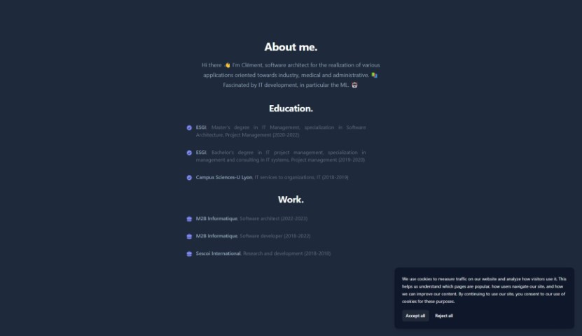

# Portfolio
[](https://github.com/Bubuclem/portfolio/actions/workflows/django.yml)
[](https://github.com/Bubuclem/portfolio/actions/workflows/codeql.yml)

Django website for very simple portfolio.



## Run dev
```bash
python manage.py runserver --settings=portfolio.configurations.development --configuration=Development
```